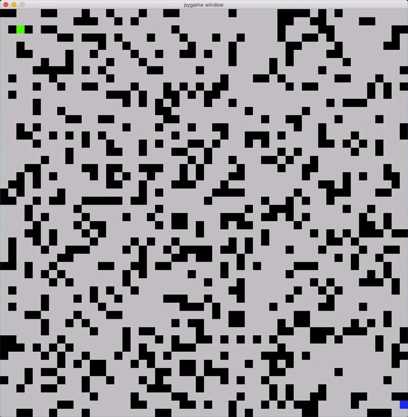

<!-- Source: https://github.com/MattIPv4/template/blob/master/README.md -->

<!-- Title -->
<h1 align="center" id="Dijkstrastar">
    Dijkstrastar
</h1>

<!-- Tag line -->
<h3 align="center">A Python, PyGame simulation of Dijkstra and A*, running at the same time.</h3>

<!-- Badges -->

    
    
    

----

<!-- Content -->
## Dijkstra and A* at the same time

I decided to refresh my memory on how Dijkstra and A* operate, ready for my final exam on them, I would write a Python
script that runs both of them at the same time for a visual comparison.

_Demonstration of the script, running on a 50x50 grid with a 0.25 chance of walls._
_Magenta is the A* path, cyan is the Dijkstra path._

This started as just a PyGame simulation of A*, but then I decided to allow the heuristic to be forced to zero, which
simulates Dijkstra's algorithm. With that change made I could then abstract the main grid to its own class and allow
multiple searches to be run and rendered at the same time, resulting in the current code.

<!-- Contributing -->
## Contributing

Contributions are always welcome to this project!\
Take a look at any existing issues on this repository for starting places to help contribute towards, or simply create your own new contribution to the project.

Please make sure to follow the existing standards within the project such as code styles, naming conventions and commenting/documentation.

When you are ready, simply create a pull request for your contribution and I will review it whenever I can!

### Donating

You can also help me and the project out by contributing through a donation on PayPal or by supporting me monthly on my Patreon page.

    
    

<!-- Discussion & Support -->
## Discussion, Support and Issues

Need support with this project, have found an issue or want to chat with others about contributing to the project?
> Please check the project's issues page first for support & bugs!

Not found what you need here?
* If you have an issue, please create a GitHub issue here to report the situation, include as much detail as you can!
* _or,_ You can join our Slack workspace to discuss any issue, to get support for the project or to chat with contributors and myself:

